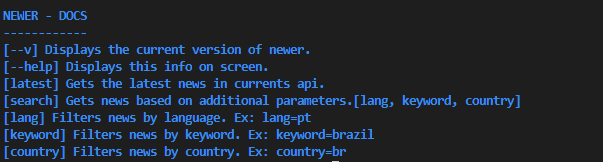

# newer

### Newer is a haskell cli app to list and search for news using the currents api

<h3>Install and Usage</h3>

```
cd newer 
stack build
./.stack-work/install/hash/bin/newer
```

<h4>You will get a result like this</h4>


<h4>You can also get the latest news using</h4>

```
./.stack-work/install/hash/bin/newer latest
```


<h4>Or search for specific news using additional parameters</h4>

```
./.stack-work/install/hash/bin/newer search lang=en
./.stack-work/install/hash/bin/newer search country=br
./.stack-work/install/hash/bin/newer search keyword=programming
./.stack-work/install/hash/bin/newer search lang=en country=br keyword=programming
```


